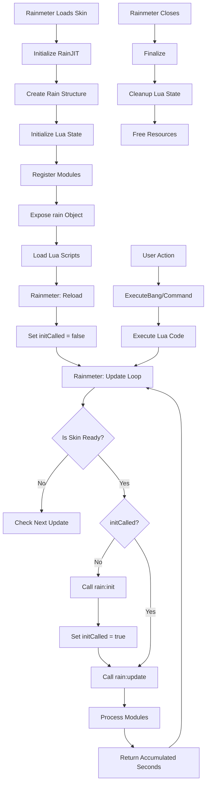
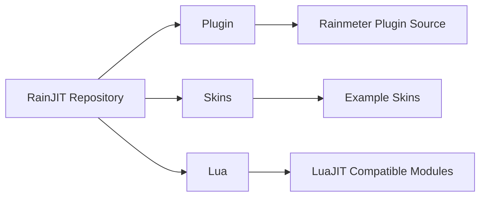

<div align="center">

  # RainJIT

  ### Run LuaJIT scripts inside Rainmeter with near-native performance.

  <br>

  
  
  
  
  
  
  
  
  
  

  <br>
  <br>


  

</div>


## Summary

<details>

<summary><ins>Table of contents</ins></summary>

- [Overview](#overview)
- [Motivation](#dart-motivation)
- [Features](#green_book-features)
- [Manual Installation](#manual-installation)
- [Quick Example](#jigsaw-quick-example)
  - [Skin Configuration](#skin-configuration)
  - [Inline Script](#inline-script)
  - [Command with Inline Script](#command-with-inline-script)
- [Module `rain`](#green_book-module-rain)
  - [Properties read-only](#diamond_shape_with_a_dot_inside-properties-read-only)
  - [Method `rain:absPath()`](#large_orange_diamond-method-rainabspath)
  - [Method `rain:formula()`](#large_orange_diamond-method-rainformula)
  - [Method `rain:var()`](#large_orange_diamond-method-rainvar)
  - [Method `rain:getSkin()`](#large_orange_diamond-method-raingetskin)
  - [Method `rain:getRect()`](#large_orange_diamond-method-raingetrect)
  - [Method `rain:option()`](#large_orange_diamond-method-rainoption)
  - [Method `rain:getX() Y·W·H`](#large_orange_diamond-method-raingetx-ywh)
  - [Method `rain:bang()`](#large_orange_diamond-method-rainbang)
  - [Method `rain:moveSkin()`](#large_orange_diamond-method-rainmoveskin)
- [Event Handlers](#event-handlers)
  - [Method `rain:init()`](#large_orange_diamond-method-raininit)
  - [Method `rain:update()`](#large_orange_diamond-method-rainupdate)
- [Wrapper and Override Functions](#wrapper-and-override-functions)
  - [Method `print()`](#large_orange_diamond-method-print)
  - [Method `import()`](#large_orange_diamond-method-import)
- [Execute Bang](#execute-bang)
  - [CommandMeasure](#commandmeasure)
  - [Section Variables `eval()`](#section-variables-eval)
- [Native Modules](#paperclip-links)
- [File Locations](#file-locations)
- [Debugging Tips](#debugging-tips)
- [Performance Considerations](#performance-considerations)
- [Lifecycle Flowchart](#cyclone-lifecycle-flowchart)
- [License](#scroll-license)
- [Links](#paperclip-links)
- [Contributing](#handshake-contributing)
- [Monorepo Structure](#file_folder-monorepo-structure)

</details>


<br>
<br>

## Overview

**RainJIT** is a native **Rainmeter** plugin that integrates a complete [**LuaJIT**](https://luajit.org/) runtime environment into each Measure. It enables the direct execution of scripts with near-C performance and provides full access to the **Rainmeter** API.<br>
This plugin acts as a seamless bridge between the **Rainmeter** skins and the powerful features of [**LuaJIT**](https://luajit.org/), including the [**FFI library**](https://luajit.org/ext_ffi.html). It allows you to invoke external C functions without the need to compile a new plugin, while also using C data structures directly from pure Lua.

<br>


## :dart: Motivation

Initially, my intention was to try to create a plugin to run C scripts without needing to compile them, and the [**TinyCC**](https://bellard.org/tcc/) offers this functionality.<br>
I found myself needing simple Windows features, such as a [**MessageBox**](https://learn.microsoft.com/pt-br/windows/win32/api/winuser/nf-winuser-messagebox). However, this approach diverges from typical **Rainmeter** [**community**](https://forum.rainmeter.net/) practices and I opted to use **LuaJIT** which also allows execution of C code without compilation and has slightly better performance than traditional Lua.


<br>


## :green_book: Features

- **Full LuaJIT 2.1 Integration**: Complete Lua 5.1 compatibility with JIT compilation
- **Per-Measure Isolation**: Each Measure maintains its own Lua state
- **Delta-Time Support**: Accurate timing for smooth animations and updates
- **Embedded Scripts**: Execute inline Lua code or load external Lua files
- **UTF-8/UTF-16 Support**: Robust encoding handling for international text
- **Thread-Safe**: Safe for use in **Rainmeter** main thread
- **Extensible Modules**: Built-in modules for HTTP requests, hotkeys, and persistent storage

<br>


## Manual Installation

1. Download [**RainJIT.dll**](./build) to your **Rainmeter** [**Plugins directory**](https://docs.rainmeter.net/manual/plugins/).
3. Download [**`lua51.dll`**](./Lua/bin/) to [**Rainmeter folder installed**](https://docs.rainmeter.net/manual/installing-rainmeter/).<br>
   > RainJIT dynamically links against the **LuaJIT** runtime (`lua51.dll`).
4. Download [**Lua Folder**](./Lua) to [**@Vault Folder**](https://docs.rainmeter.net/manual/distributing-skins/vault-folder/).
   > Contains modules compatible with **LuaJIT** and **Rainmeter**.

<br>


## :jigsaw: Quick Example

### Skin Configuration

```ini
[RainJIT]
  Measure=Plugin
  Plugin=RainJIT
  Script=script.lua

[MeterText]
  Meter=String
  Text=[RainJIT:eval(return rain.name)]
  DynamicVariables=1
```

### Inline Script

```ini
[RainJIT]
  Measure=Plugin
  Plugin=RainJIT
  Script="print('Hello from Lua!'); rain:bang('!About')"
```

### Command with Inline Script

```ini
[MeterText]
  Meter=String
  RightMouseUpAction=!CommandMeasure RainJIT "print('RightMouse Action!')"
```

---

<br>
<br>


## :green_book: Module `rain`

The global `rain` object provides access to **Rainmeter** functionality from Lua.

### :diamond_shape_with_a_dot_inside: Properties _read-only_

| Property    | Type       | Description               |
| :--         | :--:       | :--                       |
| `rain.hwnd` | _userdata_ | Window handle of the skin |
| `rain.name` | _string_   | Name of the Measure       |

<br>


### :large_orange_diamond: Method `rain:absPath()`

Converts relative paths to absolute paths. Accepts variables and [**canonical paths**](https://learn.microsoft.com/en-us/windows/win32/api/shlwapi/nf-shlwapi-pathcanonicalizew).<br>
Useful for resolving paths relative to the current skin.

```lua
-- @usage rain:absPath(filePath) → string
-- @param (string) filePath

local file = rain:absPath("../script.lua")
local skin = rain:absPath("#CURRENTPATH#../skin.ini")
```

<br>


### :large_orange_diamond: Method `rain:formula()`

A simple, easy-to-use, easy-to-integrate, and extremely [**efficient parser**](https://docs.rainmeter.net/manual/formulas/) for analyzing and evaluating mathematical expressions at runtime.<br>
Rainmeter provides a parsing engine that supports various forms of functional and logical processing semantics and is easily extensible.

> [!NOTE]
> This is a trick to get the correct parser of [**Rainmeter formula**](https://docs.rainmeter.net/manual/formulas/).<br>
> It creates an option within the section and thus manages to get the correct analysis, with variable analysis as well.<br>
> An incorrect formula generates an error log in **Rainmeter**.

```lua
-- @usage rain:formula(formula [, default]) → number
-- @param (string) formula
-- @param (number) [default=0]

print("2 + 2 * 3 =", rain:formula("2 + 2 * 3"))

-- Value of the skin width over the screen width as a percentage
print( rain:formula("(#CURRENTCONFIGWIDTH# / #SCREENAREAWIDTH#) * 100"))

-- It returns 4 and sends the error log to the Rainmeter log.
rain:formula("nil", 4)
```

<br>


### :large_orange_diamond: Method `rain:var()`

Getter or setter skin variables.<br>
Converts the value to the appropriate Lua type (`number`/`boolean`/`string`) or `nil` if don't exist or empty variable.

> [!NOTE]
> To obtain only [**Built-in variables**](https://docs.rainmeter.net/manual/variables/built-in-variables/), it is not necessary to use `#`.<br>
> Saving the variable to a file will always save it in the [`[Variables]`](https://docs.rainmeter.net/manual/variables/#Section) section.<br><br>
> If you want to obtain a `boolean` value, it must be in lowercase (`true`/`false`), otherwise it will be converted as a string.

```lua
-- @usage rain:var(name [, value [, filePath]]) → any
-- @param (string) name Variable name
-- @param (any) [value] New value
-- @param (string) [filePath] File to save the variable. It can also be the current skin.

-- Getter
rain:var("CURRENTPATH")
rain:var("#CURRENTPATH#image.png")

-- Setter
rain:var("MyVar", 48)

-- Save variable value in file
rain:var("Downloaded", true, rain:var("#@#global.inc"))
```

<br>


### :large_orange_diamond: Method `rain:isFocused()`

Checks if the current Skin window is in focus.<br>
This function returns `true` if the Skin window is in focus; otherwise, it returns `false`.


```lua
-- @usage rain:isFocused() → boolean

function rain:update(au, dt)

  if rain:isFocused() then
    -- ...
  end
end
```

<br>


### :large_orange_diamond: Method `rain:getSkin()`

Get the window identifier (**HWND**). Based on the Skin name of current skin.

> [!TIP]
> functionality similar to [**PluginConfigActive**](https://github.com/jsmorley/ConfigActive)

```lua
-- @usage rain:getSkin(skin) → userdata
-- @param (string) skin
-- @return returns nil if the skin is not found

rain:getSkin("illustro\\Clock")
```

<br>


### :large_orange_diamond: Method `rain:getRect()`

Returns Skin window rectangle using WinAPI.<br>
You can also obtain the rectangle from another **Skin** by specifying **HWND**.

> [!NOTE]
> To obtain a correct value, you must use this function after the skin has fully started.<br>
> You can use it in [`rain:init`](#large_orange_diamond-method-raininit) or [`rain:update`](#large_orange_diamond-method-rainupdate).

```lua
-- @usage rain:getRect([ hwnd ]) → table
-- @param hwnd (userdata)
-- @treturn table properties
-- @field (number) x: left position
-- @field (number) y: top position
-- @field (number) r: right position
-- @field (number) w: width size
-- @field (number) b: bottom position
-- @field (number) h: height size

function rain:init()
  -- Rect of the current Skin
  print( rain:getRect().x )

  -- Rect of another Skin
  local hwnd = rain:getSkin("illustro\\Clock")
  print( rain:getRect( hwnd ).x )
end
```

<br>


### :large_orange_diamond: Method `rain:option()`

Get the section option and converts the value to the appropriate Lua type (`boolean`/`number`/`string`) or `nil` if don't exist or empty.

> [!IMPORTANT]
> If you want to obtain a `boolean` value, it must be in lowercase (`true`/`false`), otherwise it will be converted as a string.<br>
> If you try to get the value of the options (`X`/`Y`/`W`/`H`) and it contains letters, such as [`10R`](https://docs.rainmeter.net/manual/meters/general-options/#XY), it will return `string`.<br><br>
> Whenever you try to get the Rect value from the section, this needs to be done after the skin has fully loaded, and for that you will need to use [`rain:init`](#large_orange_diamond-method-raininit) or [`rain:update`](#large_orange_diamond-method-rainupdate).

```lua
-- @usage rain:option(section, option [, default]) → any
-- @param (string) section Skin section name
-- @param (string) option Meter/Measure option
-- @param (any) [default] Default value if option doesn't exist

rain:option("MeterText", "Text", "My content") -- string
rain:option("MeterText", "FontSize" )          -- number

-- [MeterText]
-- X = 10R
function rain:init()
  print( rain:option("MeterText", "X")) -- string (10R)
  print( rain:var("[MeterText:X]"))     -- number (correct left position)
end
```

<br>


### :large_orange_diamond: Method `rain:getX() Y·W·H`

Get the position and size of the current skin using **Rainmeter** [**Built-in variables**](https://docs.rainmeter.net/manual/variables/built-in-variables/#CURRENTCONFIGXYWH).

> [!IMPORTANT]
> The correct value will only be displayed after the skin has fully loaded. Remember to use [`rain:init`](#large_orange_diamond-method-raininit) or [`rain:update`](#large_orange_diamond-method-rainupdate).

```lua
-- @usage rain:getX() → number

function rain:init()
  local x = rain:getX() -- Skin X position
  local y = rain:getY() -- Skin Y position
  local w = rain:getW() -- Skin width
  local h = rain:getH() -- Skin height
end
```

<br>


### :large_orange_diamond: Method `rain:bang()`

Executes a **Rainmeter** default [**Bang**](https://docs.rainmeter.net/manual/bangs/).

```lua
-- @usage rain:bang( bang [, arg1, arg2, ...])
-- @param (string) bang
-- @param (string) arg

rain:bang("!SetOption", "MeterText", "Text", "Hello")

-- Multiple Bangs using raw string
rain:bang([[
  [!SetOption MeterText Text Hello]
  [!SetVariable Name "Lua JIT"]
]])
```

<br>


### :large_orange_diamond: Method `rain:moveSkin()`

Moves the skin window to the specified screen coordinates.

> [!WARNING]
> Avoid using negative numbers

```lua
-- @usage rain:moveSkin(x,y)
-- @param x (number) X coordinate (screen position)
-- @param y (number) Y coordinate (screen position)

-- Move current skin to position (100, 200)
rain:moveSkin(100, 200)

-- Move to center of screen (example calculation)
function rain:init()
  local rect = rain:getRect()
  local screenW = rain:var("SCREENAREAWIDTH")
  local screenH = rain:var("SCREENAREAHEIGHT")

  local centerX = math.floor((screenW - rect.w) / 2)
  local centerY = math.floor((screenH - rect.h) / 2)
  rain:moveSkin(centerX, centerY)
end
```

---

<br>
<br>


## Event Handlers

### :large_orange_diamond: Method `rain:init()`

If the [`rain:init()`](#large_orange_diamond-method-raininit) method is defined, it will be called once when the skin is activated or refreshed. This happens even if the script Measure is disabled.

> [!TIP]
> Unlike the traditional **Rainmeter** [**Lua Initialize function**](https://docs.rainmeter.net/manual/lua-scripting/#Initialize), this function is only called after the Skin is fully loaded, including the [**Fade Duration**](https://docs.rainmeter.net/manual/settings/skin-sections/#FadeDuration).<br>
> This helps to gather information about skin dimensions, avoiding incorrect zero values.

```lua
--- Called once when skin is ready
function rain:init()
  print("Skin Width", rain:getW())
  rain:var("Initialized", "true")
end
```

<br>


### :large_orange_diamond: Method `rain:update()`

If the [`rain:update()`](#large_orange_diamond-method-rainupdate) method is defined, it will be called whenever the Skin is updated.

> [!NOTE]
> This method does not return a value to the Measure, unlike the **Rainmeter** [**Lua Update function**](https://docs.rainmeter.net/manual/lua-scripting/#Update).<br>
> If you need a value for the Measure, use the [`eval`](#large_orange_diamond-method-eval) function, but the idea is to maintain greater control in Lua scripts.

> [!TIP]
> **Param `au`:** accumulated updates (resets every ~9 quadrillion seconds)<br>
> A counter of the total number of updates since the skin started.
> This value increments each time the Plugin Update() function is called, representing how many times the measure has been updated.
> The counter automatically resets to zero when it reaches approximately 9 quadrillion (2^53 – 1), ensuring no loss of precision in numeric representations.
> Ideal for frame‑based operations such as step‑by‑step animations, sequences, or any logic that depends on update counts.
>
> **Param `dt`:** delta time in seconds (clamped to 0.0-1.0)<br>
> This parameter indicates the elapsed time between the current frame and the previous one. The value is limited between 0.0 and 1.0,
> which avoids large variations that could cause unwanted behavior in animations or Skin logic.
> **dt** is especially useful for ensuring that movement and interactions in the Skin are smooth and
> consistent, regardless of the frame rate. For example, if you want to move an object
> at a constant speed, you can multiply the speed by the **dt** variable to get the correct movement
> during each frame.

> [!WARNING]
> To ensure smooth animation, it's necessary to set the Skin to [`Update=1`](https://docs.rainmeter.net/manual/skins/rainmeter-section/#Update). However, this setting can be risky as it may result in an overload of updates.
> Therefore, it's recommended to keep all `Meter` and `Measure` elements set to [`UpdateDivider=-1`](https://docs.rainmeter.net/manual/meters/general-options/#UpdateDivider) _(except the **RainJIT Measure**)_. This approach prevents **Rainmeter** from updating them with every update, allowing you to manually update only when necessary. This not only improves performance but also provides greater control over the flow of animations and updates in the Skin.

```lua
-- Called every frame
-- @param au: accumulated updates (resets every ~9 quadrillion seconds)
-- @param dt: delta time in seconds (clamped to 0.0-1.0)

function rain:update(au, dt)
  -- Example: Rotating animation
  local angle = (au * 360) % 360
  rain:var("Rotation", tostring(angle))
end
```

---

<br>


## Wrapper and Override Functions

### :large_orange_diamond: Method `print()`

Custom debug logger that overrides Lua default `print`.<br>
This function formats all received arguments into a single string, replaces double quotes to avoid command parsing issues, and forwards the result to **Rainmeter** debug log via `!Log`.

> Differences from standard `print`:
> - Arguments are separated by four spaces
> - Output is sent to **Rainmeter** debug log
> - Double quotes (`"`) are replaced with typographic quotes (`”`)

```lua
-- @usage print( param [, param2, param3, ...]) → nil

print("Hello", "Rain JIT", 123, {x = 1})
```

<br>


### :large_orange_diamond: Method `import()`

To maintain compatibility between `x64` and `x86` versions, I created this dynamic loader of native modules using **LuaJIT FFI**.<br><br>
This method loads architecture-specific native DLLs (.dll) at runtime and registers them in `package.loaded`, mimicking Lua standard `require` behavior.<br>
Path for loading DLLs: `#SKINSPATH#@Vault\lua\bin`<br>

> - Detects the CPU architecture via **LuaJIT FFI**
> - Resolves the correct binary path (`x86`/`x64`)
> - Converts Lua module names into DLL paths
> - Calls the corresponding `luaopen_*` entry point

> [!IMPORTANT]
> Some modules depend on other libraries. Make sure you have them installed beforehand to avoid unsuccessful attempts.

```lua
-- @usage import( moduleName ) → any
-- @param (string) moduleName
-- @return (any) The value returned by the module loader, or `true` if nil
-- @raise Error if the DLL cannot be loaded or initialized

  local lfs = import("lfs")
end
```

---

<br>
<br>


## Execute Bang

### CommandMeasure

Execute Lua code received via [**!CommandMeasure**](https://docs.rainmeter.net/manual/bangs/#CommandMeasure).<br>
The script is treated as inline Lua code and executed immediately in the Lua state associated with the Measure.

> [!NOTE]
> Unlike [`eval()`](#large_orange_diamond-method-eval), this function does not return a value.

```ini
[Rainmeter]
  OnRefreshAction=!CommandMeasure RainJIT "rain:bang('!Log \"Hello\"')"

[RainJIT]
  Measure=Plugin
  Plugin=RainJIT
```

<br>


### Section Variables `eval()`
Evaluate a Lua expression and return the result as a string.
This function allows **Rainmeter** to execute Lua code via variable substitution:

> [!NOTE]
> The function expects a single argument containing Lua code.<br>
> The Lua code is executed, and its return value is converted to a string.<br>
> If the Lua code returns multiple values, only the first is used.<br>
> If the Lua code returns no values, empty string is returned.

> [!WARNING]
> This function is called from **Rainmeter** main thread but should avoid long-running operations.<br>
> Use this only when you need to obtain a specific result, but try to do it using the script Lua.

 ```ini
[RainJIT]
  Measure=Plugin
  Plugin=RainJIT
  Script="print('Hello from LuaJIT!'); rain:bang('!About')"

[MeterText]
  Meter=String
  Text=[RainJIT:eval( print("Hello from eval!"); return 123 )]
  DynamicVariables=1
```

---

<br>
<br>


### File Locations

**RainJIT** resolves [**Lua modules**](./Lua_Modules) using the following search order:

> [!TIP]
> Vault Folder is the ideal place to store all Lua modules, allowing all skins to use the same modules and avoiding unnecessary duplication.

| Folder Path              | Type                                                                                               | Info                                                        |
| :--:                     | :--:                                                                                               | :---                                                        |
| `#SKINSPATH#@Vault\lua\` | [@Vault Folder](https://docs.rainmeter.net/manual/distributing-skins/vault-folder/)                | :trophy: ⠀**Recommended** – Shared by all skins             |
| `#@#\lua\`               | [@Resources Folder](https://docs.rainmeter.net/manual/skins/resources-folder/)                     | :thumbsup: ⠀**Works well** – Good for skin-specific modules |
| `#CURRENTPATH#\lua\`     | [Current Skin Folder](https://docs.rainmeter.net/manual/variables/built-in-variables/#CURRENTPATH) | :warning: ⠀**Restricted** – Limited to current skin         |

---

<br>


### Debugging Tips

1.  Use `print()` for debug output (goes to Rainmeter log)
2.  Check Rainmeter log for Lua errors with stack traces
3.  Use `rain:var()` to output debug values to skin
4.  Wrap risky code in `pcall()`

<br>


### Performance Considerations

*   **Delta-Time**: Automatically clamped to 0.0-1.0 seconds
*   **Update Rate**: Plugin returns accumulated seconds for Rainmeter timing
*   **Memory**: Each Measure has isolated Lua state, cleaned up on skin close
*   **String Limits**: `eval()` returns limited to 4095 characters

<br>
<br>


## :cyclone: Lifecycle Flowchart

<details>

<summary><ins>Mermaid Graph</ins></summary>



</details>

<br>
<br>


## :scroll: License
<a href="./assets/images/logo-gpl-v2.png">
  
</a>

The **RainJIT** Plugin is licensed under the [**GPL v2.0 license**](./LICENSE).<br>
This project also relies on external libraries that may use different open-source licenses.<br>
If you are contributing documentation or changes to the source code, please ensure that your contributions comply with the project's licensing guidelines.

<br>

---

<br>
<br>


## :paperclip: Links

> [!TIP]
> **RainJIT** has modules developed exclusively for **Rainmeter** to improve performance and ease of use.<br>
> I decided to create these modules to reduce the amount of `Measure` required for Skins.

- [**Rainmeter Documentation**](https://docs.rainmeter.net)
- [**LuaJIT Website**](https://luajit.org)
- [**Lua 5.1 Reference Manual**](https://www.lua.org/manual/5.1/)
  <br><br>
  **Lua Modules**
  - [**LuaFileSystem (lfs)**](https://github.com/lunarmodules/luafilesystem) - **_(Lunar Modules) Module_**
  - [**winapi**](https://github.com/stevedonovan/winapi/blob/master/readme.md) - [**_(Steve J Donovan) Module_**](https://github.com/stevedonovan/winapi)
  - [**Hotkey**](./assets/doc/HOTKEY-README.md) -  **_RainJIT_** - (_Inspiration_ [**Plugin HotKey**](https://github.com/brianferguson/HotKey.dll))
  - [**Fetch**](./assets/doc/FETCH-README.md) - **_RainJIT_**
  - [**Depot**](./assets/doc/DEPOT-README.md) - **_RainJIT_**
  - [**Glass**](./Lua/glass/README.md) - **_Module_** - (_Inspiration_ [**FrostedGlass**](https://github.com/KazukiGames82/FrostedGlass))
  - [**JSON**](https://github.com/rxi/json.lua) - [**_(rxi) Module_**](https://github.com/rxi/json.lua)

---

<br>
<br>


## :handshake: Contributing

Contributions are welcome.

To get started, please read [**CONTRIBUTING.md**](./CONTRIBUTING.md) for:
- Development setup
- Code style guidelines
- Pull request process

---

<br>
<br>


## :file_folder: Monorepo Structure

```
RainJIT Repository
 ├ Plugin
 |  └ Rainmeter plugin source code
 |
 ├ Skins
 |  └ Example skins demonstrating RainJIT usage
 |
 └ Lua
    └ Optional Lua/LuaJIT modules
```



---

<br>
<br>


<div align="center">

  #### Made with :heart: for the [_community_](https://forum.rainmeter.net/).

</div>


