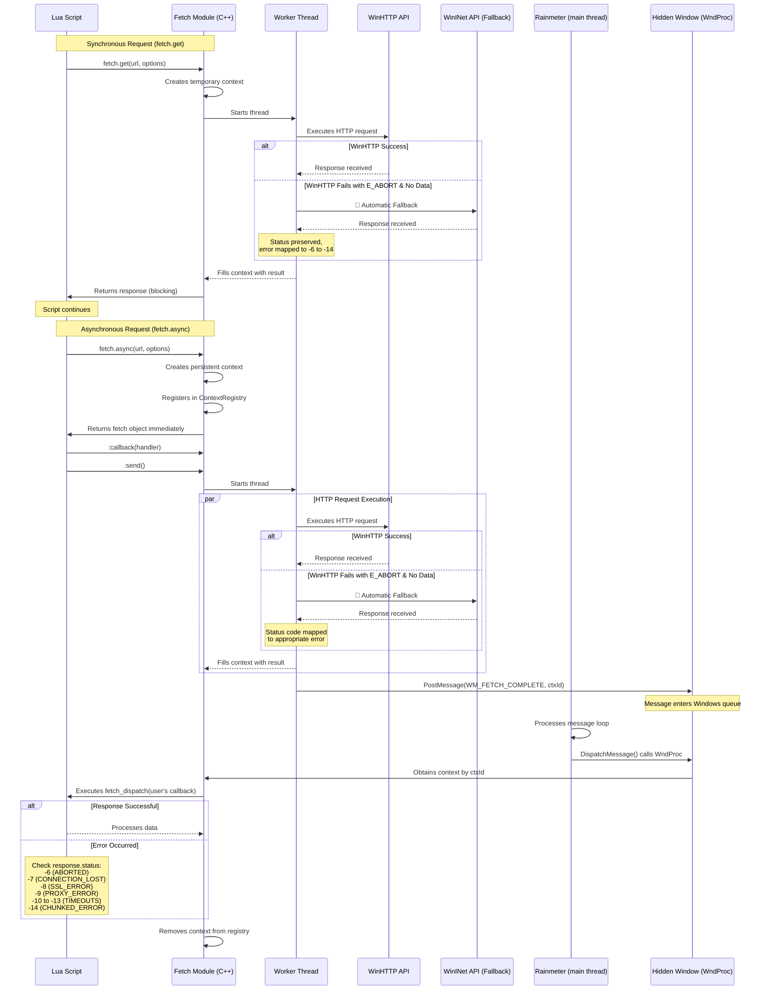

<div align="center">

  # Fetch Module

  ### HTTP Client for RainJIT

  <br>

</div>


## Summary
<details>

<summary><ins>Table of contents</ins></summary>

- [Overview](#overview)
- [Features](#green_book-features)
- [Synchronous vs Asynchronous](#vs-understanding-synchronous-vs-asynchronous)
- [Synchronous API](#large_orange_diamond-api-fetch---sync)
- [Asynchronous API](#large_orange_diamond-api-fetchasync)
- [Request Options](#diamond_shape_with_a_dot_inside-request-options-object)
- [Request Methods - _async_](#diamond_shape_with_a_dot_inside-request-object-methods---async)
  - [`:send()`](#large_orange_diamond-method-requestsend)
  - [`:callback()`](#large_orange_diamond-method-requestcallback)
  - [`:save()`](#large_orange_diamond-method-requestsave)
  - [`:hasCompleted()`](#large_orange_diamond-method-requesthascompleted)
  - [`:getResponse()`](#large_orange_diamond-method-requestgetresponse)
  - [`:cancel()`](#large_orange_diamond-method-requestcancel)
- [Response Object](#diamond_shape_with_a_dot_inside-response-object)
- [Examples](#jigsaw-examples)
- [Performance](#zap-performance-tips)
- [Limitations](#warning-limitations)
- [HTTP Method Semantics](#globe_with_meridians-http-method-semantics)

</details>

<br>
<br>


## Overview

A powerful HTTP/HTTPS client module for **RainJIT** with both **synchronous** and **asynchronous** requests, automatic response processing, and full binary support.

<br>
<br>


## :green_book: Features

- **Dual API**: Synchronous methods for simplicity, asynchronous for performance
- **Auto-Dispatch**: Integrated automatic callback processing via [**PostMessage**](https://learn.microsoft.com/pt-br/windows/win32/api/winuser/nf-winuser-postmessagea) (hidden window)
- **Binary Support**: Perfect for images, files, and any binary data
- **Flexible Timeouts**: Phase-specific timeouts (DNS, connect, send, receive)
- **Modern TLS**: Support for TLS 1.2 and 1.3
- **Automatic Compression**: Gzip/deflate handling
- **Cookie Management**: Automatic cookie extraction from responses

---

<br>
<br>


## :vs: Understanding Synchronous vs Asynchronous

Synchronous methods are your **go-to tool for simple, fast, sequential operations**. They shine in initialization, configuration loading, quick API checks, and any scenario where code simplicity outweighs the need for parallelism. Keep them fast (<500ms), always handle errors, and don't hesitate to switch to async when dealing with slow or large operations.

<br>

Before we delve deeper into the subject, let's understand the main difference.

| Aspect         | Synchronous           | Asynchronous          |
| :--            | :--:                  | :--:                  |
| **Execution**  | Blocks until complete | Returns immediately   |
| **Threads**    | Runs in main thread   | Creates worker thread |
| **UI Impact**  | Can freeze if slow    | Never blocks UI       |
| **Complexity** | Simple, linear code   | Requires callbacks    |
| **Use Case**   | Quick operations      | Slow/long operations  |

> [!IMPORTANT]
> ##### Asynchronous worker thread
> - Not recommended to launch hundreds of simultaneous requests.
> - There is no thread pool.
> - The cost of creating a thread is not negligible.

---

<br>
<br>


# :book: Usage

## Basic Usage

```lua
-- load module
local fetch = require("fetch")

-- Sync request equivalent to fetch.get()
local response = fetch("https://api.github.com/users/octocat")

if response.ok then
    print("Status:", response.status)
    print("Data:", response.text)
else
    print("Error:", response.error)
end
```

---

<br>
<br>


## :large_orange_diamond: API `fetch` - _**sync**_

Performs a blocking HTTP request and returns the response table directly.

- Executes on the main Lua thread
- Blocks until completion
- Returns a response object
- Simpler control flow

#### Signature

```lua
-- Equivalent to fetch.get()
fetch(url [, options]) → response

-- HTTP Methods
fetch.get(url [, options]) → response
fetch.post(url [, options]) → response
fetch.put(url [, options]) → response
fetch.patch(url [, options]) → response
fetch.delete(url [, options]) → response
fetch.head(url [, options]) → response
fetch.options(url [, options]) → response
```

<br>
<br>


## :large_orange_diamond: API `fetch.async`

**Automatic Dispatch System**<br>
By default, all asynchronous requests are processed automatically. When a response is ready, the callback will be executed automatically in the next Update cycle.

Returns a request object for control and monitoring. The request starts immediately when `:send()` is called.


### Default Behavior

```lua
local request = fetch.async("https://api.example.com/data")
request:callback(function(self, response)
  -- Called AUTOMATICALLY when the response is ready
  print("Automatic response:", response.text)
end)

request:send()
```

---

<br>
<br>


## :diamond_shape_with_a_dot_inside: Request Options Object

The options table can be passed to any fetch function (`fetch.get`, `fetch.post`, `fetch.async`, etc.) to configure the HTTP request. Below is a detailed description of each available field.

> [!NOTE]
> All timeout values are in milliseconds. The underlying WinHTTP implementation enforces minimum reasonable values (e.g., DNS timeout at least 5000 ms, connect timeout at least 10000 ms) to ensure reliable operation.<br><br>
> Phase‑specific timeouts (`dnsTimeout`, `connectTimeout`, `sendTimeout`, `receiveTimeout`) override the general `timeout` for their respective phases.<br><br>
> The `body` field, when provided, is sent as‑is. For textual data, ensure proper encoding (e.g., UTF‑8) is used; binary data (e.g., from file reads) is handled transparently.

<table>
  <tr>
    <td align="center" nowrap="nowrap">
      <h4>Field</h4>
    </td>
    <td align="center" nowrap="nowrap">
      <h4>Description</h4>
      
    </td>
  </tr>

  <tr>
    <td align="center" nowrap="nowrap">
      <h5><code>method</code></h5>
    </td>
    <td rowspan="2">
      <p>The HTTP method to use <b>for</b> <code>fetch.async</code>. You can specify any allowed method.</p>
    </td>
  </tr>
  <tr>
    <td nowrap="nowrap">
      <b>Type:</b> <code>string</code>
      <br>
      <b>Default:</b> <code>"GET"</code>
      <br>
      <b>Allowed Values:</b>
      <ul>
        <li><code>GET</code></li>
        <li><code>POST</code></li>
        <li><code>PUT</code></li>
        <li><code>PATCH</code></li>
        <li><code>DELETE</code></li>
        <li><code>HEAD</code></li>
        <li><code>OPTIONS</code></li>
      </ul>
    </td>
  </tr>

  <tr>
    <td align="center" nowrap="nowrap">
      <h5><code>headers</code></h5>
    </td>
    <td rowspan="2">
      <p>A key–value table of HTTP headers to include in the request. Header names are case‑insensitive per the HTTP specification, but they are sent as provided.</p>
    </td>
  </tr>
  <tr>
    <td nowrap="nowrap">
      <b>Type:</b> <code>table</code>
      <br>
      <b>Default:</b> <code>{}</code>
      <br>
      <b>Example:</b> <pre>{ ["User-Agent"] = "MyApp/1.0", ["X-Custom"] = "value" }</pre>
    </td>
  </tr>

  <tr>
    <td align="center" nowrap="nowrap">
      <h5><code>body</code></h5>
    </td>
    <td rowspan="2">
      <p>Request body data. Can be a plain text string or binary data (e.g., file contents).<br>Used only with methods that support a body (<code>POST</code>,<code>PUT</code>,<code>PATCH</code>).</p>
    </td>
  </tr>
  <tr>
    <td nowrap="nowrap">
      <b>Type:</b> <code>string</code>
      <br>
      <b>Default:</b> <code>nil</code>
    </td>
  </tr>

  <tr>
    <td align="center" nowrap="nowrap">
      <h5><code>timeout</code></h5>
    </td>
    <td rowspan="2">
      <p>Overall request timeout in milliseconds. If a phase‑specific timeout (see below) is not set, this value is used as a fallback for that phase. The minimum effective value is 1000 ms.</p>
    </td>
  </tr>
  <tr>
    <td nowrap="nowrap">
      <b>Type:</b> <code>integer</code>
      <br>
      <b>Default:</b> <code>30000</code>
    </td>
  </tr>

  <tr>
    <td align="center" nowrap="nowrap">
      <h5><code>dnsTimeout</code></h5>
    </td>
    <td rowspan="2">
      <p>Timeout for DNS resolution in milliseconds.<br>If zero or omitted, falls back to the value of timeout.</p>
    </td>
  </tr>
  <tr>
    <td nowrap="nowrap">
      <b>Type:</b> <code>integer</code>
      <br>
      <b>Default:</b> <code>0</code> (uses <code>timeout</code>)
    </td>
  </tr>

  <tr>
    <td align="center" nowrap="nowrap">
      <h5><code>connectTimeout</code></h5>
    </td>
    <td rowspan="2">
      <p>Timeout for establishing the TCP connection (and the TLS handshake for HTTPS) in milliseconds. Falls back to <code>timeout</code> if zero.</p>
    </td>
  </tr>
  <tr>
    <td nowrap="nowrap">
      <b>Type:</b> <code>integer</code>
      <br>
      <b>Default:</b> <code>0</code> (uses <code>timeout</code>)
    </td>
  </tr>

  <tr>
    <td align="center" nowrap="nowrap">
      <h5><code>sendTimeout</code></h5>
    </td>
    <td rowspan="2">
      <p>Timeout for sending the request data in milliseconds. Falls back to <code>timeout</code> if zero.</p>
    </td>
  </tr>
  <tr>
    <td nowrap="nowrap">
      <b>Type:</b> <code>integer</code>
      <br>
      <b>Default:</b> <code>0</code>(uses <code>timeout</code>)
    </td>
  </tr>

  <tr>
    <td align="center" nowrap="nowrap">
      <h5><code>receiveTimeout</code></h5>
    </td>
    <td rowspan="2">
      <p>Timeout for receiving the response data in milliseconds. Falls back to <code>timeout</code> if zero.</p>
    </td>
  </tr>
  <tr>
    <td nowrap="nowrap">
      <b>Type:</b> <code>integer</code>
      <br>
      <b>Default:</b> <code>0</code> (uses <code>timeout</code>)
    </td>
  </tr>

  <tr>
    <td align="center" nowrap="nowrap">
      <h5><code>followRedirects</code></h5>
    </td>
    <td rowspan="2">
      <p>If <code>true</code>, the client automatically follows HTTP redirects (3xx status codes). If <code>false</code>, the original redirect response is returned as‑is.</p>
    </td>
  </tr>
  <tr>
    <td nowrap="nowrap">
      <b>Type:</b> <code>boolean</code>
      <br>
      <b>Default:</b> <code>true</code>
    </td>
  </tr>

  <tr>
    <td align="center" nowrap="nowrap">
      <h5><code>httpVersion</code></h5>
    </td>
    <td rowspan="2">
      <p>Controls which HTTP protocol version to use for the request. Which can resolve issues with chunked encoding on certain APIs (like <a href="https://open-meteo.com/"><b>open-meteo.com</b></a>).</p>
      <p><strong>Why this matters:</strong> Some APIs return responses with <code>Transfer-Encoding: chunked</code> which can cause problems with certain HTTP stacks. Forcing HTTP/1.0 disables chunked encoding and ensures compatibility.</p>
    </td>
  </tr>
  <tr>
    <td nowrap="nowrap">
      <b>Type:</b> <code>string</code>
      <br>
      <b>Default:</b> <code>"1.1"</code>
      <br>
      <b>Allowed Values:</b>
      <ul>
        <li><code>1.0</code></li>
        <li><code>1.1</code></li>
      </ul>
    </td>
  </tr>
</table>

---

<br>
<br>


## :diamond_shape_with_a_dot_inside: Request Object Methods - _**async**_

## :large_orange_diamond: Method `request:send()`

**Starts the asynchronous request**. This method must be called to initiate the HTTP operation. Until `:send()` is invoked, no network activity occurs.

> [!NOTE]
> If the request is already active or completed, calling `:send()` again has no effect.<br>
> The request runs in a separate worker thread, so the main Lua thread continues immediately.

```lua
local request = fetch.async("https://api.example.com/data")

-- @param None
-- @return The request object (for chaining)
request:send()
```

<br>


## :large_orange_diamond: Method `request:callback()`

**Registers a function to be called when the request completes**. The handler receives two arguments: the request object itself (`self`) and the response table.

> [!NOTE]
> Only one callback can be set per request; calling `:callback()` again replaces the previous one.<br>
> The `response` table contains the same fields as returned by synchronous methods (`ok`, `status`, `body`, `text`, `headers`, `cookies`, `error`).

```lua
-- @param (function) handler: A Lua function with signature
-- @return The request object (for chaining)
fetch.async("https://api.example.com/data")
  :callback(function(self, response)
    if response.ok then
      print("Received:", response.text)
    else
      print("Error:", response.error)
    end
  end)
  :send()
```

<br>


## :large_orange_diamond: Method `request:save()`

**Saves the raw response body to a file.** This is particularly useful for binary data (images, archives, PDFs) or when you need to persist the downloaded content.

> [!NOTE]
> The method creates any missing directories in the path automatically.<br>
> The file is written in binary mode – the exact bytes received from the server are stored.<br>
> If the response body is empty, the method returns `false` with an appropriate error message.

```lua
-- @param (string) filePath: Full filesystem path where the file should be saved
-- @return (boolean) success: true if saved successfully, false otherwise
-- @return (string|nil) error: Error message if saving failed, nil otherwise
local success, err = response:save("#@#image.jpg")

if success then
  print("File saved!")
else
  print("Save failed:", err)
end
```

<br>


## :large_orange_diamond: Method `request:hasCompleted()`

**Checks whether the request has finished** (either successfully or with an error). This is useful when `autoDispatch is disabled, or when you need to poll for completion.

> [!NOTE]
> After completion, the response data is available via `:getResponse()`.<br>
> The callback (if set) will not fire until you call `:dispatch()` (or until auto‑dispatch triggers it).

```lua
-- Manual polling (autoDispatch = false)
local req = fetch.async("https://api.example.com/data", { autoDispatch = false })
req:callback(function(self, resp) print("Done!") end)
req:send()

--- In your update loop
-- @param None
-- @return true if the request is complete, false otherwise
if req:hasCompleted() then
  req:dispatch()
end
```

<br>


## :large_orange_diamond: Method `request:getResponse()`

**Returns the response table** for the completed request. If the request has not yet finished, the returned table may contain incomplete or default values (e.g., `status = -1`, `error = "Request pending"`).<br>
It is safe to call this method at any time.

> [!NOTE]
> The returned table is a snapshot; it does not update automatically as the request progresses.<br>
> After completion, the same response is passed to the callback.

```lua
-- Retrieve response without using callback
local req = fetch.async("https://api.example.com/data")
req:send()

-- Later, after checking hasCompleted()
if req:hasCompleted() then

  -- @param None
  -- @return A table with the same structure as the synchronous response (see Response Object in the main documentation)
  local resp = req:getResponse()
  print("Status:", resp.status)
end
```

<br>


## :large_orange_diamond: Method `request:cancel()`

**Cancels an ongoing request** if it is still in progress. If the request has already completed, this method has no effect.

> [!NOTE]
> Cancellation sets the response status to `-2` and the error message to `"Request cancelled"`.<br>
> The callback (if any) will still be invoked (or can be dispatched) with the cancelled response.<br>
> Any resources used by the request are cleaned up as soon as possible.

```lua
local req = fetch.async("https://slow.example.com/bigfile")
req:send()

-- @param None
-- @return The request object (for chaining)
req:cancel()
```

---

<br>
<br>


## :diamond_shape_with_a_dot_inside: Response Object

When a request completes (synchronously or asynchronously), the result is returned as a Lua table with the following fields:

> [!IMPORTANT]
> Special Status Codes (Negative Values)<br>
> When the request cannot be completed normally, the status field may contain one of the following custom error codes:
>
> | Code  | Meaning | Description |
> | :--:  | :-- | :-- |
> | `-1`  | **Network Error** | Generic network or HTTP error (e.g., connection refused, protocol error). Check `error` field for details. |
> | `-2`  | **Cancelled** | Request was cancelled by the user via the `:cancel()` method. |
> | `-3`  | **Invalid URL** | URL format is invalid or could not be parsed. |
> | `-4`  | **No Internet** | No internet connection detected. |
> | `-5`  | **Thread Error** | Failed to create a worker thread for the request. |
> | `-6`  | **Aborted** | Operation aborted (E_ABORT) - usually indicates a connection issue or server closed connection prematurely. |
> | `-7`  | **Connection Lost** | Connection was lost during data transfer. |
> | `-8`  | **SSL/TLS Error** | SSL/TLS security failure (certificate issues, protocol mismatch). |
> | `-9`  | **Proxy Error** | Proxy configuration error or connection failure. |
> | `-10` | **DNS Timeout** | DNS resolution timed out. |
> | `-11` | **Connect Timeout** | Connection establishment timed out. |
> | `-12` | **Send Timeout** | Request data transmission timed out. |
> | `-13` | **Receive Timeout** | Response data reception timed out. |
> | `-14` | **Chunked Error** | Error processing chunked encoding response. |

> [!NOTE]
> The `ok` field is simply a shorthand for `status >= 200 and status < 300`.<br><br>
> For successful responses, `error` will be an empty string.<br><br>
> The `body` field always contains the raw bytes; the `text` field is derived from `body` by interpreting it as a UTF‑8 string. If the response is binary (e.g., an image), `text` may contain invalid data.<br><br>
> Headers are returned exactly as received from the server; duplicate header names are combined according to HTTP rules (comma‑separated values) and appear as a single entry.<br><br>
> Cookies are parsed from `Set-Cookie` headers. Only the cookie name and value are stored; attributes like `Path`, `Expires`, etc. are ignored.


<table>
  <tr>
    <td align="center" nowrap="nowrap">
      <h4>Field</h4>
      
    </td>
    <td align="center" nowrap="nowrap">
      <h4>Description</h4>
    </td>
  </tr>

  <tr>
    <td align="center" nowrap="nowrap">
      <h5><code>ok</code></h5>
    </td>
    <td rowspan="2">
      <p><code>true</code> if the HTTP status code is in the range 200–299 (indicating success), <code>false</code> otherwise.</p>
    </td>
  </tr>
  <tr>
    <td nowrap="nowrap">
      <b>Type:</b> <code>boolean</code>
    </td>
  </tr>

  <tr>
    <td align="center" nowrap="nowrap">
      <h5><code>status</code></h5>
    </td>
    <td rowspan="2">
      <p>The HTTP status code returned by the server (e.g., 200, 404, 500). If the request failed before receiving a response, this may contain a negative error code (see below).</p>
    </td>
  </tr>
  <tr>
    <td nowrap="nowrap">
      <b>Type:</b> <code>integer</code>
    </td>
  </tr>

  <tr>
    <td align="center" nowrap="nowrap">
      <h5><code>body</code></h5>
    </td>
    <td rowspan="2">
      <p>The raw response body as a Lua string. This field is always present and contains the exact bytes received from the server.</p>
    </td>
  </tr>
  <tr>
    <td nowrap="nowrap">
      <b>Type:</b> <code>string</code>
    </td>
  </tr>

  <tr>
    <td align="center" nowrap="nowrap">
      <h5><code>text</code></h5>
    </td>
    <td rowspan="2">
      <p>A convenience field that attempts to interpret the <code>body</code> as text. For textual responses (e.g., HTML, JSON, plain text), this contains the decoded string. For binary data, the content may be garbled – use <code>body</code> instead.</p>
    </td>
  </tr>
  <tr>
    <td nowrap="nowrap">
      <b>Type:</b> <code>string</code>
    </td>
  </tr>

  <tr>
    <td align="center" nowrap="nowrap">
      <h5><code>error</code></h5>
    </td>
    <td rowspan="2">
      <p>An error message describing what went wrong. Empty string (<code>""</code>) if no error occurred.</p>
    </td>
  </tr>
  <tr>
    <td nowrap="nowrap">
      <b>Type:</b> <code>string</code>
    </td>
  </tr>

  <tr>
    <td align="center" nowrap="nowrap">
      <h5><code>headers</code></h5>
    </td>
    <td rowspan="2">
      <p>Function that returns a key-value table of response headers. The header names are provided as they appear in the response. Example:<br><code>{ ["content-type"] = "application/json" }</code>.</p>
    </td>
  </tr>
  <tr>
    <td nowrap="nowrap">
      <b>Type:</b> <code>function</code>
    </td>
  </tr>

  <tr>
    <td align="center" nowrap="nowrap">
      <h5><code>cookies</code></h5>
    </td>
    <td rowspan="2">
      <p>Function that returns a key-value table of cookies extracted from any Set-Cookie headers in the response. Each cookie name corresponds to its value. Example:<br><code>{ session = "abc123", user = "john" }</code>.</p>
    </td>
  </tr>
  <tr>
    <td nowrap="nowrap">
      <b>Type:</b> <code>function</code>
    </td>
  </tr>

</table>

---

<br>
<br>


## :jigsaw: Examples

###  1. Parallel Requests with Auto-Dispatch

```lua
-- All callbacks fire automatically when each request completes

local urls = {
  users = "https://api.example.com/users",
  posts = "https://api.example.com/posts",
  comments = "https://api.example.com/comments"
}

for name, url in pairs(urls) do
  fetch.async(url)
  :callback(function(self, response)
    if response.ok then
      print(string.format("%s: %d bytes", name, #response.body))
    else
      print(string.format("%s failed: %s", name, response.error))
    end
  end)
  :send()
end
```

<br>


### 2. Custom Timeout Configuration

```lua
-- Fine-tuned timeouts for a slow API
local response = fetch.get("https://slow-api.example.com/data", {
  dnsTimeout = 3000,        -- 3s for DNS
  connectTimeout = 5000,    -- 5s for connection
  sendTimeout = 10000,      -- 10s to send request
  receiveTimeout = 30000,   -- 30s to receive response
  timeout = 45000           -- Overall 45s limit
})
```

<br>


### 3. File Upload with Progress Simulation

```lua
function uploadFile(url, filepath, filename)
  -- Read file
  local file = io.open(filepath, "rb")
  if not file then return nil, "Cannot open file" end
  local data = file:read("*a")
  file:close()

  -- Create boundary for multipart
  local boundary = "----WebKitFormBoundary" .. os.time()
  local body = "--" .. boundary .. "\r\n"
  body = body .. 'Content-Disposition: form-data; name="file"; filename="' .. filename .. '"\r\n'
  body = body .. "Content-Type: application/octet-stream\r\n\r\n"
  body = body .. data .. "\r\n"
  body = body .. "--" .. boundary .. "--\r\n"

  local request = fetch.async(url, {
    method = "POST",
    headers = {
      ["Content-Type"] = "multipart/form-data; boundary=" .. boundary
    },
    body = body
  })

  request:callback(function(self, response)
    if response.ok then
      print("Upload complete!")
    else
      print("Upload failed:", response.error)
    end
  end)

  request:send()
  return true
end

-- Usage
uploadFile("https://httpbin.org/post", "document.pdf", "document.pdf")
```

<br>


### 4. Robust Error Handling

```lua
function safeFetch(url, options)
  options = options or {}
  options.timeout = options.timeout or 15000

  local response = fetch.get(url, options)

  if response.ok then
    return response, nil
  end

  -- Map status codes to user-friendly messages
  local errors = {
    [404] = "Resource not found",
    [403] = "Access denied",
    [429] = "Rate limit exceeded",
    [500] = "Server error",
    [502] = "Bad gateway",
    [503] = "Service unavailable",
    [-4] = "No internet connection",
    [-3] = "Invalid URL",
    [-2] = "Request cancelled"
  }

  local message = (
    errors[response.status]
    or
    string.format("HTTP %d: %s", response.status, response.error)
  )

    return nil, message
end

-- Usage
local data, err = safeFetch("https://api.example.com/data")
if err then
  print("Request failed:", err)
else
  print("Success:", data.text)
end
```

<br>


### 5. Session Handling with Cookies

```lua
-- Login and use session cookie
local function apiRequest(endpoint)
  local loginResp = fetch.post("https://api.example.com/login", {
    body = "username=admin&password=secret",
    headers = {
      ["Content-Type"] = "application/x-www-form-urlencoded"
    }
  })

  if not loginResp.ok then
    return nil, "Login failed"
  end

  -- Session cookie is automatically extracted!
  local sessionId = loginResp.cookies.session

  -- Use session for authenticated request
  return fetch.get("https://api.example.com/" .. endpoint, {
    headers = {
      ["Cookie"] = "session=" .. sessionId
    }
  })
end
```

---

<br>
<br>


## :zap: Performance Tips

- Set Appropriate Timeouts: Match timeouts to your specific use case
- Batch Requests: Use async methods for multiple simultaneous requests
- Monitor Memory: Large responses are kept entirely in memory
- Reuse Connections: WinHTTP handles connection pooling automatically

---

<br>
<br>


## :warning: Limitations

- **Thread per Request**: Each async request creates a dedicated thread
- **Memory Constraints**: Full response is buffered in memory
- **No Streaming**: All data must be received before processing
- **HTTP/1.1 & HTTP/2 Only**: HTTP/3 not supported by WinHTTP
- **No WebSockets**: Not implemented
- **Windows Only**: Relies on WinHTTP API
- **Fsallback Transparency**: WinINet fallback uses system proxy settings (Internet Explorer configuration)

---

<br>
<br>


## :loop: Lifecycle of Synchronous and Asynchronous Requests



---

<br>
<br>


## :globe_with_meridians: HTTP Method Semantics

This section summarizes the intended semantics of standard HTTP methods to help you choose the appropriate one.

- **GET**

  - Retrieves a representation of a resource
  - Must not have side effects
  - Idempotent
  - Cacheable
  - No request body

  _Typical use: Retrieving a document, image, or data from an API._

<br>


- **POST**

  - Submits data for processing
  - May create new resources
  - Not idempotent
  - Allows request body

  _Typical use: Submitting a form, uploading a file, or creating a new item in an API._

<br>


- **PUT**

  - Replaces an entire resource
  - Idempotent
  - Requires full representation

  _Typical use: Fully updating an existing resource (e.g., replacing a file or a user record)._

<br>


- **PATCH**

  - Partially modifies a resource
  - Not necessarily idempotent
  - Sends only changed fields

  _Typical use: Updating specific fields of a resource (e.g., changing only the email of a user profile)._

<br>


- **DELETE**

  - Removes a resource
  - Idempotent (in theory)

  _Typical use: Removing an item, file, or record from an API._

<br>


- **HEAD**

  - Same as GET but without response body
  - Used for metadata inspection

  _Typical use: Checking if a resource exists, reading its metadata (such as Content-Length or Last-Modified) without downloading the resource._

<br>


- **OPTIONS**

  - Returns supported methods
  - Used in CORS and capability discovery

  _Typical use: Discovering which HTTP methods (GET, POST, etc.) are allowed by a server for a specific URL, often used in CORS (Cross-Origin Resource Sharing) scenarios._

---

<br>
<br>

