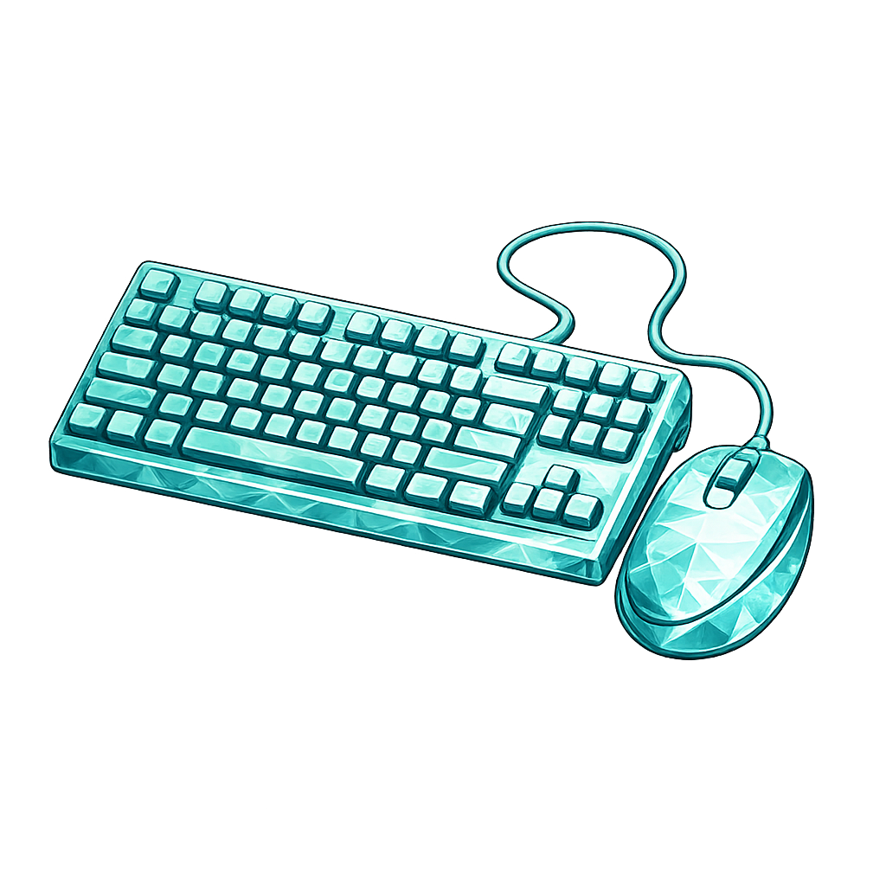

<div align="center">

  # Hotkey Module for RainJIT

  <br>
  <br>


  

</div>


## Overview
The **Hotkey module** for **RainJIT** is a low-level input detection system that leverages [**Windows hooks**](https://learn.microsoft.com/en-us/windows/win32/api/winuser/nf-winuser-setwindowshookexw). It enables **Lua scripts** to define keyboard combinations and mouse events, executing callback functions in response. It relies on a single global `WH_KEYBOARD_LL` hook and a single global `WH_MOUSE_LL` hook — shared across every Rainmeter skin — plus a thread-safe event buffer, delivering fast and reliable hotkey/mouse events to your Rainmeter skins.

<br>
<br>


## :green_book: Features

- **Global hotkeys & mouse events**: work even when Rainmeter is not in focus.
- **Full modifier support**: Ctrl, Alt, Shift, Win, and their left/right variants.
- **Flexible keyboard trigger modes**: fire on key press, release, or both.
- **Rich mouse event types**: press, release, click, double-click, long-press, move, and scroll.
- **Focus‑aware**: optionally require the skin window to have foreground focus.
- **Injected input control**: choose whether synthetic input (from other software/macros) is allowed.
- **All keys mode**: capture every keystroke for advanced use cases.
- **Multiple combinations / buttons per callback**: associate several key combos or mouse buttons with a single Lua function.
- **Configurable long-press & double-click windows** (`holdTime`, `doubleTime`) per mouse listener.
- **Thread‑safe event queue**: safe communication between the hook and the main Lua thread.
- **Automatic cleanup**: resources are freed when skins are unloaded or objects are garbage‑collected.
- **Comprehensive event tables**: detailed information about the key/mouse event, modifier states, lock states, cursor position, and more.
- **Automatic lifecycle management**: hooks are installed/uninstalled on demand.
- **Callback can block the event**: returning `false` from a callback swallows the underlying OS event.


<br>
<br>


## :jigsaw: Quick Example

### Keyboard Basic Usage

```lua
local hotkey = require("hotkey")

local kb = hotkey.keyboard({
  vk = "F12",
  on = "press",
  focus = false,

  callback = function(event)
      print("F12 pressed globally!")
  end
})
```

<br>


### Mouse Basic Usage

```lua
local hotkey = require("hotkey")

local ms = hotkey.mouse({
  button = "left",
  on = "click",
  focus = false,

  callback = function(event)
      print("Left click at", event.x, event.y)
  end
})
```

---

<br>


## :large_orange_diamond: Method `hotkey.keyboard()`

This method creates a new hotkey configuration and returns a keyboard object that provides methods for control.

All methods of the returned object will return `false` if the hotkey no longer exists (e.g., after being removed).

```lua
-- @usage hotkey.keyboard(config)
-- @param (table) config
-- @field (string|table|"all") vk
-- @field ("press"|"release"|"both") [on="both"]
-- @field (boolean) [focus=true]
-- @field (boolean) [allowInjected=true]
-- @field (function) callback
-- @return (table) An instance that represents the shortcut key

--  Multiple Combinations
local kb = hotkey.keyboard({
  focus = false,
  on = "press",
  vk = {
    "CTRL+1",
    "CTRL+NUMPAD1"
  },

  callback = function( event )
    print("A fan of keyboard shortcuts!")
  end
})


--- All Keys Logger
-- Use carefully, this captures every keystroke
hotkey.keyboard({
  vk = "all",
  focus = false,

  callback = function(event)
    print(event.type, event.vk, event.char)
  end
})


--- Blocking a Key
hotkey.keyboard({
  vk = "F1",
  on = "press",
  focus = false,

  callback = function(event)
    -- Returning false prevents F1 from reaching the foreground app.
    return false
  end
})
```

<br>


## :large_orange_diamond: Method `kb:enable()`

Re-enables a disabled hotkey.<br>
Returns `true` on success.

```lua
local success = kb:enable()
```

<br>


## :large_orange_diamond: Method `kb:disable()`
Temporarily disables the hotkey (it stays registered, but the callback will not fire).<br>
Returns `true` on success.

```lua
local success = kb:disable()
```

<br>


## :large_orange_diamond: Method `kb:isEnabled()`

Returns whether the hotkey is currently active.

```lua
local enabled = kb:isEnabled()
```

<br>


## :large_orange_diamond: Method `kb:remove()`

Permanently removes the hotkey and releases associated resources.<br>
Returns `true` on success.

```lua
local success = kb:remove()
```

<br>


## Keyboard Configuration Table

### :diamond_shape_with_a_dot_inside: Property `vk`

The `vk` field accepts several formats (`string`|`table`|`"all"`) and **is required**.<br>

> [!IMPORTANT]
> Using `vk="all"` mode
> - Combinations are ignored.
> - [`event.keys`](#diamond_shape_with_a_dot_inside-keyboard-event-object) contains only the triggering key.

**Supported formats:**

```lua
-- 1. Single key.
-- VK_ prefix is optional.
vk = "F12"
vk = "VK_ESCAPE"
vk = "A"
vk = "SPACE"

-- 2. Key combination
-- Join keys using "+" (order does not matter).
vk = "CTRL+SHIFT+F5"
vk = "VK_F12+VK_ALT"
vk = "LWIN+R"

-- 3. Multiple combinations
-- The callback fires when any combination matches.
vk = {
  "F12",
  "CTRL+SHIFT+F5",
  "ALT+SPACE"
}

-- 4. Special value "all"
-- Captures every key.
vk = "all"
```

<br>


### :diamond_shape_with_a_dot_inside: Property `on`

The `on` field accepts (`"press"`|`"release"`|`"both"`) and **is not required**.<br>
Default: `"both"`.

<br>


### :diamond_shape_with_a_dot_inside: Property `focus`

The `focus` field accepts `boolean` and **is not required**.<br>
If `true`, the callback is only called when the Skin window has foreground focus.<br>
Default: `true`.

<br>


### :diamond_shape_with_a_dot_inside: Property `allowInjected`

The `allowInjected` field accepts `boolean` and **is not required**.<br>
If `false`, synthetic key events generated by other software (e.g. macro tools, `SendInput`) are ignored.<br>
Default: `true`.

<br>


### :diamond_shape_with_a_dot_inside: Property `callback`

The `callback` field accepts (`function`) and **is required**.<br>
The function to execute when the hotkey is triggered. It receives a single event table — see [**Keyboard Event Object**](#diamond_shape_with_a_dot_inside-keyboard-event-object).<br>
Returning `false` from the callback blocks the key event from reaching other applications.

<br>


### :diamond_shape_with_a_dot_inside: Keyboard Event Object

The callback receives a single table with the following fields:

| Field         | Type      | Description                                                     |
| :--           | :--:      | :--:                                                             |
| `char`        | _string_  | UTF-8 character produced by the key (empty if non-printable).   |
| `code`        | _number_  | Virtual key code of the triggering key.                         |
| `type`        | _string_  | `"press"` or `"release"`.                                       |
| `keys`        | _table_   | Names of the keys in the matched combination.                   |
| `capslock`    | _boolean_ | Caps Lock state.                                                 |
| `numlock`     | _boolean_ | Num Lock state.                                                  |
| `scrolllock`  | _boolean_ | Scroll Lock state.                                               |
| `ctrl`        | _boolean_ | Any Ctrl key pressed.                                            |
| `alt`         | _boolean_ | Any Alt key pressed.                                             |
| `shift`       | _boolean_ | Any Shift key pressed.                                           |
| `timestamp`   | _number_  | Milliseconds elapsed since the system started.                  |
| `vk`          | _string_  | Name of the triggering key (e.g. `"VK_F12"`).                    |
| `focus`       | _boolean_ | Whether the skin window had foreground focus at trigger time.    |

---

<br>
<br>


## :large_orange_diamond: Method `hotkey.mouse()`

This method creates a new mouse listener and returns a mouse object that provides methods for control.<br>
All methods of the returned object will return `false` if the listener no longer exists (e.g., after being removed).

```lua
-- @usage hotkey.mouse(config)
-- @param (table) config
-- @field (string|table) [button="all"]
-- @field (string|table) [on="all"]
-- @field (boolean) [focus=true]
-- @field (boolean) [allowInjected=true]
-- @field (number) [holdTime=500]
-- @field (number) [doubleTime=500]
-- @field (function) callback
-- @return (table) An instance that represents the mouse listener

local ms = hotkey.mouse({
  button = "right",
  on = "longpress",
  holdTime = 700,

  callback = function( event )
    print("Right button held for 700ms+")
  end
})


-- Multiple Buttons, Multiple Events
hotkey.mouse({
  button = { "right", "left" },
  on = { "doubleclick", "longpress" },

  callback = function(event)
    print(event.button, event.type)
  end
})


-- Scroll Wheel Listener
hotkey.mouse({
  on = "scroll",
  focus = false,

  callback = function(event)
    local axis = event.horizontal and "Horizontal" or "Vertical"
    print(axis .. " scroll, delta:", event.delta)
  end
})
```

<br>


## :large_orange_diamond: Method `ms:enable()`

Re-enables a disabled mouse listener.<br>
Returns `true` on success.

```lua
local success = ms:enable()
```

<br>


## :large_orange_diamond: Method `ms:disable()`

Temporarily disables the mouse listener (it stays registered, but the callback will not fire).<br>
Returns `true` on success.

```lua
local success = ms:disable()
```

<br>


## :large_orange_diamond: Method `ms:isEnabled()`

Returns whether the mouse listener is currently active.

```lua
local enabled = ms:isEnabled()
```

<br>


## :large_orange_diamond: Method `ms:remove()`

Permanently removes the mouse listener and releases associated resources.<br>
Returns `true` on success.

```lua
local success = ms:remove()
```

<br>


## Mouse Configuration Table

### :diamond_shape_with_a_dot_inside: Property `button`

The `button` field accepts (`string`|`table`) and **is not required**.<br>
Supported values: (`"all"`|`"left"`|`"right"`|`"middle"`|`"x1"`|`"x2"`).<br>
Default: `"all"`.

```lua
button = "left"
button = { "left", "right" }
button = "all"
```

<br>


### :diamond_shape_with_a_dot_inside: Property `on`

The `on` field accepts (`string`|`table`) and **is not required**.<br>
Supported values: (`"all"`|`"press"`|`"release"`|`"click"`|`"doubleclick"`|`"longpress"`|`"move"`|`"scroll"`).<br>
Default: `"all"`.

> [!IMPORTANT]
> `"move"` and `"scroll"` are not tied to a specific button — for these events, `event.button` is reported as `"unknown"`.


```lua
on = "click"
on = { "click", "longpress" }
```

<br>


### :diamond_shape_with_a_dot_inside: Property `focus`

The `focus` field accepts (`boolean`) and **is not required**.<br>
If `true`, the callback is only called when the skin window has foreground focus.<br>
Default: `true`.

<br>


### :diamond_shape_with_a_dot_inside: Property `allowInjected`

The `allowInjected` field accepts (`boolean`) and **is not required**.<br>
If `false`, synthetic mouse events generated by other software are ignored.<br>
Default: `true`.

<br>


### :diamond_shape_with_a_dot_inside: Property `holdTime`

The `holdTime` field accepts (`number`, milliseconds) and **is not required**.<br>
Default: `500`.

Used as both:
- The **maximum** press duration for a release to still count as a `click`.
- The **minimum** press duration before a `longpress` fires.

<br>


### :diamond_shape_with_a_dot_inside: Property `doubleTime`

The `doubleTime` field accepts (`number`, milliseconds) and **is not required**.<br>
Maximum interval between two clicks (at nearly the same cursor position) for the second one to be reported as `doubleclick` instead of `click`.<br>
Default: `500`.

<br>


### :diamond_shape_with_a_dot_inside: Property `callback`

The `callback` field accepts (`function`) and **is required**.<br>
The function to execute when a matching mouse event occurs. It receives a single event table — see [**Mouse Event Object**](#diamond_shape_with_a_dot_inside-mouse-event-object).<br>
Returning `false` from the callback blocks the underlying mouse event from reaching other applications.

```lua
callback = function(event)
  print(event.type, event.button)
end
```

<br>


### :diamond_shape_with_a_dot_inside: Mouse Event Object

The callback receives a single table with the following fields:
| Field         | Type      | Description                                                                                 |
| :--           | :--:      | :--:                                                                                        |
| `type`        | _string_  | `"press"`, `"release"`, `"click"`, `"doubleclick"`, `"longpress"`, `"move"`, or `"scroll"`. |
| `button`      | _string_  | `"left"`, `"right"`, `"middle"`, `"x1"`, `"x2"`, or `"unknown"` (for `move`/`scroll`).      |
| `x`           | _number_  | Cursor X position, in screen coordinates.                                                   |
| `y`           | _number_  | Cursor Y position, in screen coordinates.                                                   |
| `delta`       | _number_  | Wheel delta, in multiples of `120` (only set for `scroll` events).                          |
| `horizontal`  | _boolean_ | `true` if the scroll was horizontal (tilt wheel), `false` for vertical.                     |
| `timestamp`   | _number_  | Milliseconds elapsed since the system started.                                              |
| `focus`       | _boolean_ | Whether the skin window had foreground focus at trigger time.                               |

<br>

**Click, Double-Click & Long-Press Detection:**
- `press` and `release` fire on every button-down / button-up, independently of the events below.
- A `click` fires on `release` if the cursor stayed within a small tolerance of the press position **and** the press was shorter than `holdTime`.
- If a previous `click` on the same button happened within `doubleTime` and near the same position, the next matching release fires `doubleclick` instead of a second `click`.
- A `longpress` fires while the button is still held down, once the elapsed time reaches `holdTime` — this suppresses `click`/`doubleclick` for that same press.
- `move` fires continuously while the cursor moves, regardless of any button state, as long as at least one mouse listener is active. A `move` beyond the tolerance also cancels any pending `longpress` detection for currently held buttons.
- `scroll` fires on every wheel tick, vertical or horizontal (see `horizontal`).

---

<br>
<br>


## Supported Key Names

- Letters: `A`–`Z`
- Numbers: `0`–`9`
- Function keys: `F1`–`F24`
- Modifiers: `CTRL`, `SHIFT`, `ALT`, `LWIN`, `RWIN`
- Navigation: `LEFT`, `RIGHT`, `UP`, `DOWN`, `HOME`, `END`
- Media keys
- OEM keys
- Numpad keys
- Gamepad virtual keys (Windows 10+)
- Raw numeric codes (`"0x41"` or `"65"`)

<br>

<details>

<summary><ins>Complete Virtual-Key Codes</ins></summary>
<br>

| Name                               | Hex  | Dec |
| :--:                               | --:  | --: |
| VK_LBUTTON                         | 0x01 | 1   |
| VK_RBUTTON                         | 0x02 | 2   |
| VK_CANCEL                          | 0x03 | 3   |
| VK_MBUTTON                         | 0x04 | 4   |
| VK_XBUTTON1                        | 0x05 | 5   |
| VK_XBUTTON2                        | 0x06 | 6   |
| VK_BACK                            | 0x08 | 8   |
| VK_TAB                             | 0x09 | 9   |
| VK_CLEAR                           | 0x0C | 12  |
| VK_RETURN                          | 0x0D | 13  |
| VK_SHIFT                           | 0x10 | 16  |
| VK_CONTROL                         | 0x11 | 17  |
| VK_MENU                            | 0x12 | 18  |
| VK_PAUSE                           | 0x13 | 19  |
| VK_CAPITAL                         | 0x14 | 20  |
| VK_ESCAPE                          | 0x1B | 27  |
| VK_SPACE                           | 0x20 | 32  |
| VK_PRIOR                           | 0x21 | 33  |
| VK_NEXT                            | 0x22 | 34  |
| VK_END                             | 0x23 | 35  |
| VK_HOME                            | 0x24 | 36  |
| VK_LEFT                            | 0x25 | 37  |
| VK_UP                              | 0x26 | 38  |
| VK_RIGHT                           | 0x27 | 39  |
| VK_DOWN                            | 0x28 | 40  |
| VK_SELECT                          | 0x29 | 41  |
| VK_PRINT                           | 0x2A | 42  |
| VK_EXECUTE                         | 0x2B | 43  |
| VK_SNAPSHOT                        | 0x2C | 44  |
| VK_INSERT                          | 0x2D | 45  |
| VK_DELETE                          | 0x2E | 46  |
| VK_HELP                            | 0x2F | 47  |
| 0                                  | 0x30 | 48  |
| 1                                  | 0x31 | 49  |
| 2                                  | 0x32 | 50  |
| 3                                  | 0x33 | 51  |
| 4                                  | 0x34 | 52  |
| 5                                  | 0x35 | 53  |
| 6                                  | 0x36 | 54  |
| 7                                  | 0x37 | 55  |
| 8                                  | 0x38 | 56  |
| 9                                  | 0x39 | 57  |
| A                                  | 0x41 | 65  |
| B                                  | 0x42 | 66  |
| C                                  | 0x43 | 67  |
| D                                  | 0x44 | 68  |
| E                                  | 0x45 | 69  |
| F                                  | 0x46 | 70  |
| G                                  | 0x47 | 71  |
| H                                  | 0x48 | 72  |
| I                                  | 0x49 | 73  |
| J                                  | 0x4A | 74  |
| K                                  | 0x4B | 75  |
| L                                  | 0x4C | 76  |
| M                                  | 0x4D | 77  |
| N                                  | 0x4E | 78  |
| O                                  | 0x4F | 79  |
| P                                  | 0x50 | 80  |
| Q                                  | 0x51 | 81  |
| R                                  | 0x52 | 82  |
| S                                  | 0x53 | 83  |
| T                                  | 0x54 | 84  |
| U                                  | 0x55 | 85  |
| V                                  | 0x56 | 86  |
| W                                  | 0x57 | 87  |
| X                                  | 0x58 | 88  |
| Y                                  | 0x59 | 89  |
| Z                                  | 0x5A | 90  |
| VK_LWIN                            | 0x5B | 91  |
| VK_RWIN                            | 0x5C | 92  |
| VK_APPS                            | 0x5D | 93  |
| VK_SLEEP                           | 0x5F | 95  |
| VK_NUMPAD0                         | 0x60 | 96  |
| VK_NUMPAD1                         | 0x61 | 97  |
| VK_NUMPAD2                         | 0x62 | 98  |
| VK_NUMPAD3                         | 0x63 | 99  |
| VK_NUMPAD4                         | 0x64 | 100 |
| VK_NUMPAD5                         | 0x65 | 101 |
| VK_NUMPAD6                         | 0x66 | 102 |
| VK_NUMPAD7                         | 0x67 | 103 |
| VK_NUMPAD8                         | 0x68 | 104 |
| VK_NUMPAD9                         | 0x69 | 105 |
| VK_MULTIPLY                        | 0x6A | 106 |
| VK_ADD                             | 0x6B | 107 |
| VK_SEPARATOR                       | 0x6C | 108 |
| VK_SUBTRACT                        | 0x6D | 109 |
| VK_DECIMAL                         | 0x6E | 110 |
| VK_DIVIDE                          | 0x6F | 111 |
| VK_F1                              | 0x70 | 112 |
| VK_F2                              | 0x71 | 113 |
| VK_F3                              | 0x72 | 114 |
| VK_F4                              | 0x73 | 115 |
| VK_F5                              | 0x74 | 116 |
| VK_F6                              | 0x75 | 117 |
| VK_F7                              | 0x76 | 118 |
| VK_F8                              | 0x77 | 119 |
| VK_F9                              | 0x78 | 120 |
| VK_F10                             | 0x79 | 121 |
| VK_F11                             | 0x7A | 122 |
| VK_F12                             | 0x7B | 123 |
| VK_F13                             | 0x7C | 124 |
| VK_F14                             | 0x7D | 125 |
| VK_F15                             | 0x7E | 126 |
| VK_F16                             | 0x7F | 127 |
| VK_F17                             | 0x80 | 128 |
| VK_F18                             | 0x81 | 129 |
| VK_F19                             | 0x82 | 130 |
| VK_F20                             | 0x83 | 131 |
| VK_F21                             | 0x84 | 132 |
| VK_F22                             | 0x85 | 133 |
| VK_F23                             | 0x86 | 134 |
| VK_F24                             | 0x87 | 135 |
| VK_NUMLOCK                         | 0x90 | 144 |
| VK_SCROLL                          | 0x91 | 145 |
| VK_LSHIFT                          | 0xA0 | 160 |
| VK_RSHIFT                          | 0xA1 | 161 |
| VK_LCONTROL                        | 0xA2 | 162 |
| VK_RCONTROL                        | 0xA3 | 163 |
| VK_LMENU                           | 0xA4 | 164 |
| VK_RMENU                           | 0xA5 | 165 |
| VK_BROWSER_BACK                    | 0xA6 | 166 |
| VK_BROWSER_FORWARD                 | 0xA7 | 167 |
| VK_BROWSER_REFRESH                 | 0xA8 | 168 |
| VK_BROWSER_STOP                    | 0xA9 | 169 |
| VK_BROWSER_SEARCH                  | 0xAA | 170 |
| VK_BROWSER_FAVORITES               | 0xAB | 171 |
| VK_BROWSER_HOME                    | 0xAC | 172 |
| VK_VOLUME_MUTE                     | 0xAD | 173 |
| VK_VOLUME_DOWN                     | 0xAE | 174 |
| VK_VOLUME_UP                       | 0xAF | 175 |
| VK_MEDIA_NEXT_TRACK                | 0xB0 | 176 |
| VK_MEDIA_PREV_TRACK                | 0xB1 | 177 |
| VK_MEDIA_STOP                      | 0xB2 | 178 |
| VK_MEDIA_PLAY_PAUSE                | 0xB3 | 179 |
| VK_LAUNCH_MAIL                     | 0xB4 | 180 |
| VK_LAUNCH_MEDIA_SELECT             | 0xB5 | 181 |
| VK_LAUNCH_APP1                     | 0xB6 | 182 |
| VK_LAUNCH_APP2                     | 0xB7 | 183 |
| VK_OEM_1                           | 0xBA | 186 |
| VK_OEM_PLUS                        | 0xBB | 187 |
| VK_OEM_COMMA                       | 0xBC | 188 |
| VK_OEM_MINUS                       | 0xBD | 189 |
| VK_OEM_PERIOD                      | 0xBE | 190 |
| VK_OEM_2                           | 0xBF | 191 |
| VK_OEM_3                           | 0xC0 | 192 |
| VK_OEM_4                           | 0xDB | 219 |
| VK_OEM_5                           | 0xDC | 220 |
| VK_OEM_6                           | 0xDD | 221 |
| VK_OEM_7                           | 0xDE | 222 |
| VK_OEM_8                           | 0xDF | 223 |
| VK_OEM_102                         | 0xE2 | 226 |
| VK_GAMEPAD_A                       | 0xC3 | 195 |
| VK_GAMEPAD_B                       | 0xC4 | 196 |
| VK_GAMEPAD_X                       | 0xC5 | 197 |
| VK_GAMEPAD_Y                       | 0xC6 | 198 |
| VK_GAMEPAD_RIGHT_SHOULDER          | 0xC7 | 199 |
| VK_GAMEPAD_LEFT_SHOULDER           | 0xC8 | 200 |
| VK_GAMEPAD_LEFT_TRIGGER            | 0xC9 | 201 |
| VK_GAMEPAD_RIGHT_TRIGGER           | 0xCA | 202 |
| VK_GAMEPAD_DPAD_UP                 | 0xCB | 203 |
| VK_GAMEPAD_DPAD_DOWN               | 0xCC | 204 |
| VK_GAMEPAD_DPAD_LEFT               | 0xCD | 205 |
| VK_GAMEPAD_DPAD_RIGHT              | 0xCE | 206 |
| VK_GAMEPAD_MENU                    | 0xCF | 207 |
| VK_GAMEPAD_VIEW                    | 0xD0 | 208 |
| VK_GAMEPAD_LEFT_THUMBSTICK_BUTTON  | 0xD1 | 209 |
| VK_GAMEPAD_RIGHT_THUMBSTICK_BUTTON | 0xD2 | 210 |

</details>

---

<br>
<br>


## Performance Notes

- Only one global keyboard hook (`WH_KEYBOARD_LL`) and one global mouse hook (`WH_MOUSE_LL`) are installed, regardless of how many hotkeys/listeners are registered.
- All skins share the same hook instances.
- Keyboard matching cost scales with the number of registered combinations.
- Avoid registering excessive `vk="all"` handlers.
- `move` and `scroll` listeners run for every cursor movement / wheel tick while active — keep those callbacks lightweight.

---

<br>
<br>


## Limitations

1. **Auto-repeat behavior**<br>
Holding a key may generate repeated `"press"` events.

2. **Combination detection relies on real-time key state**<br>
Uses `GetAsyncKeyState`, so extremely rapid sequences may behave differently under high CPU load.

3. **Heavy callbacks can impact responsiveness**<br>
Hooks run synchronously with input delivery — keep Lua callbacks lightweight to avoid input lag or the hook being disabled by Windows.

4. **Injected events are allowed by default**<br>
Synthetic input from other software (macros, automation tools, etc.) will trigger callbacks unless `allowInjected = false` is set.

5. **No built-in debounce mechanism**<br>
If needed, implement it in Lua.

---

<br>
<br>


## Best Practices

- Keep callbacks fast.
- Use `focus = true` when possible.
- Prefer specific combinations/buttons instead of `"all"`.
- Set `allowInjected = false` if you specifically want to ignore automation/macro input.
- Tune `holdTime` / `doubleTime` to match the responsiveness you want for `click` / `doubleclick` / `longpress`.
- Remove unused hotkeys and mouse listeners with `:remove()`.

---

<br>
<br>


## License

Licensed under the **GPL v2.0 License**.

---

<br>
<br>
